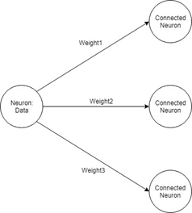
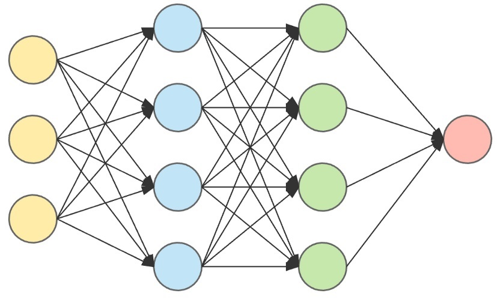

### NEURAL NETWORKS
---
Consider the linear regression issue, which we have discussed previously. A loss function is a concept that we have. By reducing the loss function, a neural network narrows in on the proper answer to a problem.
Assume we have the following basic linear equation: y = mx + b. This guesses a y value given some x values.
Predictive models are not always 100% accurate. The loss is a measure of how inaccurate it is. The purpose of machine learning is to reduce the loss function using a training set. This is true for linear regression, neural networks, and other machine learning techniques.
The same basic idea applies to neural networks, except that the inputs and outputs are binary. Perceptrons are the things that do the calculations. They make adjustments to decrease the loss function until the model is extremely precise. Handwriting analysis, for example, may be 99 percent correct.

Neural networks are supposed to function similarly to the human brain. When it comes to identifying handwriting or face recognition, the brain reaches conclusions swiftly. In the instance of face recognition, for example, the brain would ask, "Is it female or male?" Is it white or black? Is it youthful or old? "Does there appear to be a scar?" and so on.

The fundamentals of biological neurons are divided into two phases. All active neurons connecting to biological neurons excite them. By adding the product of the input neurons and their weighted connections, programmed neurons replicate stimulation.

In biology, if the stimulus is strong enough to cause the molecules involved to cross a particular threshold, the neuron fires and activates all neurons to which it is connected. In fact, we do not threshold programmed neurons unless they are in the output layer. Instead, linked neurons use the datum created by the summation and weights to calculate their intensity of stimulation. The data from an output neuron may be sent through an indicator function, which thresholds and activates. As a result, only output neurons may "fire."

**ACTIVATION FUNCTION**
An Activation Function decides whether a neuron should be activated or not. This means that it will decide whether the neuron’s input to the network is important or not in the process of prediction using simpler mathematical operations. 
The role of the Activation Function is to derive output from a set of input values fed to a node (or a layer).
In deep learning, this is also the role of the Activation Function—that’s why it’s often referred to as a Transfer Function in Artificial Neural Network.  
The primary role of the Activation Function is to transform the summed weighted input from the node into an output value to be fed to the next hidden layer or as output. 
Elements of a Neural Networks Architecture:
1. Input Layer
2. Hidden Layer
3. Output Layer

**Why do Neural Networks Need an Activation Function?**
Activation functions introduce an additional step at each layer during the forward propagation, but its computation is worth it. Here is why—
Let’s suppose we have a neural network working without the activation functions. 
In that case, every neuron will only be performing a linear transformation on the inputs using the weights and biases. It’s because it doesn’t matter how many hidden layers we attach in the neural network; all layers will behave in the same way because the composition of two linear functions is a linear function itself.
Although the neural network becomes simpler, learning any complex task is impossible, and our model would be just a linear regression model.
Types:
1. Tanh
2. ReLU
3. Sigmoid
In the code we are using ReLU functions which is :
$$f(x) = max(0,x)$$

**Feedforward vs. Backpropagation**
Feedforward Propagation - the flow of information occurs in the forward direction. The input is used to calculate some intermediate function in the hidden layer, which is then used to calculate an output. 

Backpropagation - the weights of the network connections are repeatedly adjusted to minimize the difference between the actual output vector of the net and the desired output vector.
To put it simply—backpropagation aims to minimize the cost function by adjusting the network’s weights and biases. The cost function gradients determine the level of adjustment with respect to parameters like activation function, weights, bias, etc.

**LOSS FUNCTION**
A method for determining if the algorithm is doing well — This is required to calculate the difference between the algorithm's current output and its predicted output. The measurement is utilised as a feedback signal to change the algorithm's behaviour. This stage of adjustment is referred to as learning.
The loss function is the function that computes the distance between the current output of the algorithm and the expected output. It’s a method to evaluate how your algorithm models the data. It can be categorized into two groups. One for classification (discrete values, 0,1,2…) and the other for regression (continuous values).

What are the commonly used loss functions to train a Neural Network?
- Cross-entropy
- Log loss
- Exponential Loss
- Hinge Loss
- Kullback Leibler Divergence Loss
- Mean Square Error (MSE — L2)
- Mean Absolute Error (MAE — L1)
- Huber Loss
We iterate the loss funtion to maximize th efficiency of model and the no. of steps or iterations are called epochs.
Loss function in our code is 'mean_squared_error'.
It is just as the name suggest.

**MODEL**
Input data (Yellow) are processed against a hidden layer (Blue) and modified against another hidden layer (Green) to produce the final output (Red).

The original Perceptron was designed to take a number of binary inputs, and produce one binary output (0 or 1).

In our code we have 3 layers.(only 1 hidden layer)

The idea was to use different weights to represent the importance of each input, and that the sum of the values should be greater than a threshold value before making a decision like true or false (0 or 1).
Frank Rosenblatt suggested this algorithm:
1. Set a threshold value
2. Multiply all inputs with its weights
3. Sum all the results
4. Activate the output

In the above figure:
The First Layer:
The 3 yellow perceptrons are making 3 simple decisions based on the input evidence. Each single decision is sent to the 4 perceptrons in the next layer.
The Second Layer:
The blue perceptrons are making decisions by weighing the results from the first layer. This layer make more complex decisions at a more abstract level than the first layer.
The Third Layer:
Even more complex decisions are made by the green perceptons.

**TRAINING**
STEPS:
1. Create a Perceptron Object
2. Create a Training Function
3. Train the perceptron against the desired answers
In the process;
- The Perceptron will start with a random weight for each input.
- For each mistake, while training the Perceptron, the weights will be adjusted with a small fraction.This small fraction is the "Perceptron's learning rate".In the Perceptron object we call it learnc.
- Sometimes, if both inputs are zero, the perceptron might produce an in correct output.To avoid this, we give the perceptron an extra input with the value of 1.This is called a bias.

After training we test our model and our model gets better the more we use it.

---
